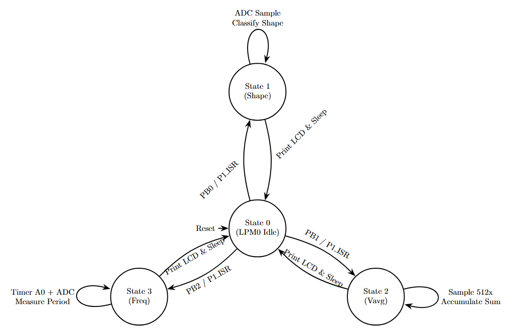

# MSP430-ADC-Signal-Analyzer

An interrupt-driven, Simple Finite State Machine (FSM) implemented in MSP430 Assembly that functions as a digital signal analyzer. It samples an incoming analog signal (100Hz - 1kHz, 0V-Vcc) using the ADC10 module, classifies its waveform, and calculates its precise average voltage and frequency using fixed-point arithmetic.

## Hardware Requirements
* **MCU:** Texas Instruments MSP430G2553
* **Display:** 16x2 Character LCD (Interfaced via Port 1 & Port 2)
* **Inputs:** * 3x External Push-Buttons (P1.0, P1.1, P1.2)
    * Analog Signal Generator connected to P1.3 (A3)

## Features & Architecture
The system is built on a highly efficient, non-blocking software architecture utilizing Low Power Mode (LPM0):

* **State 0 (Idle):** The system rests in LPM0 to conserve power.
* **State 1 (Shape Classification):** Triggered by PB0. Samples the wave to classify it as a Sine, Triangle, or PWM signal, updating the LCD dynamically.
* **State 2 (Average Voltage):** Triggered by PB1. Averages 512 ADC samples. Uses a high-precision `UQ12.20` fixed-point arithmetic algorithm (base-2 bit-shifting and 32-bit intermediate products) to calculate and display the voltage without floating-point overhead.
* **State 3 (Frequency Measurement):** Triggered by PB2. Utilizes Timer A0 (TA0) and the ADC10 in tandem to measure the period of the wave and calculate its frequency.

## Software Design
* **Pure Assembly:** Written entirely in MSP430 instruction set.
* **Modular Design:** Separated into `Main`, `HAL` (Hardware Abstraction Layer), `API` (Math and LCD drivers), and `BSP` (Board Support Package) for maximum portability.
* **Interrupt-Driven:** Completely eliminates blocking delay loops (`polling`) inside ISRs, ensuring the CPU never misses critical ADC or Timer interrupts.

## Author

&#x20;  hamzahoot2

